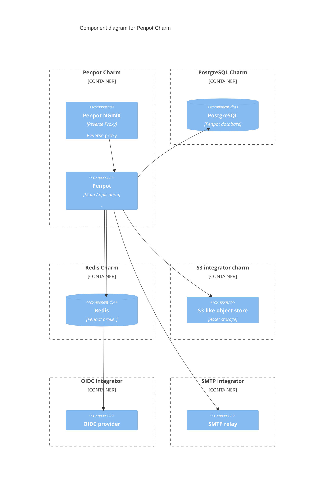

# Charm architecture

The penpot-operator charm aims to provide the core functionalities of Penpot with horizontally scalable architecture.

Operational capabilities are enhanced through integrations with the Canonical Observability Stack ([COS](https://charmhub.io/topics/canonical-observability-stack/))
charms.

## Context

Details on the Penpot architecture can be found in the [Penpot Technical Guide](https://help.penpot.app/technical-guide/developer/architecture/).

The following diagrams details the deployment architecture with Juju charms:



## Containers

The charm design leverages the [sidecar](https://kubernetes.io/blog/2015/06/the-distributed-system-toolkit-patterns/#example-1-sidecar-containers) pattern to allow multiple containers in each pod with [Pebble](https://juju.is/docs/sdk/pebble) running as the workload container’s entrypoint.

Pebble is a lightweight, API-driven process supervisor that is responsible for configuring processes to run in a container and controlling those processes throughout the workload lifecycle.

Pebble `services` are configured through [layers](https://github.com/canonical/pebble#layer-specification), and the following containers represent each one a layer forming the effective Pebble configuration, or `plan`:

1. An [NGINX](https://www.nginx.com/) container, which can be used to efficiently serve static resources, as well as be the incoming point for all web traffic to the pod.
2. The [Penpot](https://penpot.app) container itself.

## OCI images

We use [Rockcraft](https://canonical-rockcraft.readthedocs-hosted.com/en/latest/) to build OCI Images for Penpot.
The image is defined in [rockcraft.yaml](penpot_rock/rockcraft.yaml).
They are published to [Charmhub](https://charmhub.io/), the official repository of charms.

## Metrics

The Penpot container exposes JVM and Penpot specific metrics, including:

- penpot_rpc_command_timing_bucket
- penpot_tasks_timing_bucket

These two metrics are used to propose a default monitoring dashboard which is visible in Grafana after [integrating with COS](https://charmhub.io/pollen/docs/how-to-relate-to-cos).

## Integrations

### `postgresql` integration

The [`postgresql`](https://charmhub.io/postgresql) or [`postgresql-k8s`](https://charmhub.io/postgresql) charm can
provide the PostgreSQL database required for Penpot to run.

### `s3` integration

The [`s3-integrator`](https://charmhub.io/s3-integrator) charm can configure Penpot with S3-compatible storage,
which is necessary for Penpot to run.

### `redis` integration

The [`redis-k8s`](https://charmhub.io/redis-k8s) charm can provide the Redis database required for Penpot to run.

### `ingress` integration

The [`nginx-ingress-integrator`](https://charmhub.io/nginx-ingress-integrator) or
[`traefik-k8s`](https://charmhub.io/traefik-k8s) charm can provide the ingress service required for Penpot to run.
Penpot mandates HTTPS, so please enable HTTPS on the respective ingress charms.

### `smtp` integration

[`smtp-integrator`](https://charmhub.io/smtp-integrator) and other charms implementing the `smtp` integration can
optionally provide SMTP credentials to enable the Penpot charm to send email notifications and other email-related functionality.

### `oauth`

[Identity Platform bundle](https://charmhub.io/identity-platform) and other charms implementing the `oauth`
integration can optionally provide OpenID Connect settings for the Penpot charm.
This will disable the user/password login in the Penpot charm and switch to using the OpenID Connect login flow.

## Juju events

The charm observes the lifecycle events ("created", "changed", "broken"...) associated to the different relations (including the peer relation). It also observes the "config_changed", "upgrade_charm" and "secret_changed" events.

Following the [holistic](https://ops.readthedocs.io/en/latest/explanation/holistic-vs-delta-charms.html) charm approach, each of these events will trigger a "reconcile" loop.

Additionally, two actions event are observed to execute the associated actions:

- `create_profile`
- `delete_profile`

## Charm code overview

The `src/charm.py` file contains all the charm logic. It is the default entry point for the charm and has the `PenpotCharm` Python class which inherits
from CharmBase. CharmBase is the base class from which all charms are formed, defined
by [Ops](https://juju.is/docs/sdk/ops) (Python framework for developing charms).

> See more in the Juju docs: [Charm](https://documentation.ubuntu.com/juju/latest/user/reference/charm/)

The `__init__` method guarantees that the charm observes all events relevant to its operation and handles them.

The charm follows the [holistic](https://ops.readthedocs.io/en/latest/explanation/holistic-vs-delta-charms.html) pattern, so almost all events will trigger a "reconcile loop".

Take, for example, when a configuration is changed by using the CLI.

1. User runs the configuration command: `juju config smtp-from-address=myaddress@mydomain.com`
2. A `config-changed` event is emitted.
3. In the `__init__` method is defined how to handle this event like this: ```python self.framework.observe(self.on.config_changed, self._reconcile)```
4. The method `_reconcile`, for its turn, will take the necessary actions such as waiting for all the relations to be ready and then configuring the containers.
